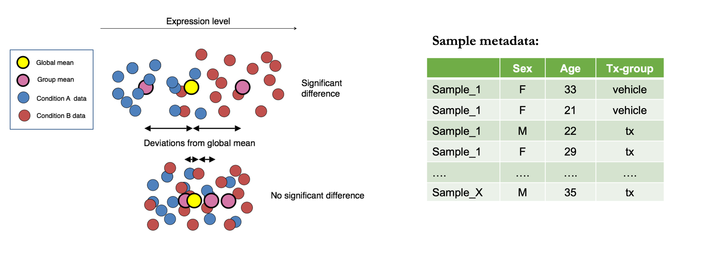
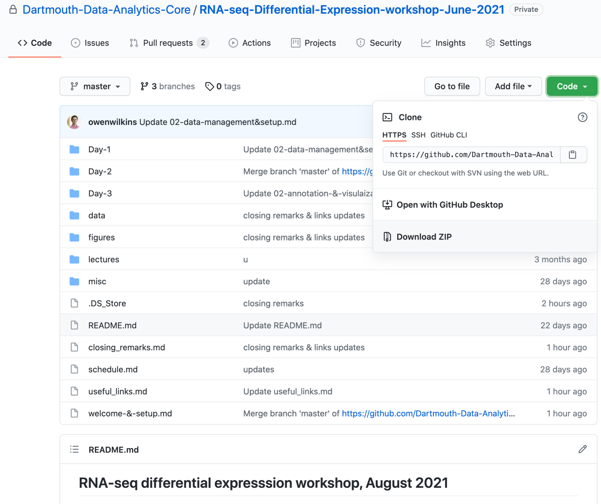
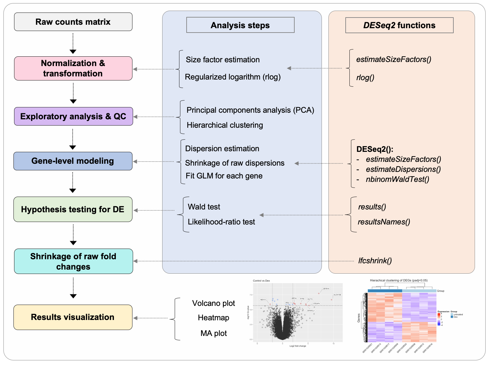

# Data Management and Setup
------------------------------

### Learning objectives:
- Understand the basic concepts behind a differential expression analysis 
- Understand the experimental design for dataset we will be using
- Learn how to read raw count data from an RNA-seq experiment into R

----------

### What is a differential expression analysis? 

Often the goal of a project using RNA-seq is to identify genes whose expression varies across samples with an experimental condition of interest. We refer to these genes as *differentially expressed* and can offer insight into the biological processes affected by the experimental condition. 

To perform a differential expression analysis, we perform a separate statistical test for each gene detected in our dataset. The statistical test models the read count distribution across samples in each experimental group, and allows us to test if the mean expression level of the gene in each experimental group is significantly different. 

<p align="center">

</p>

> Image adapted from: https://hbctraining.github.io/DGE_workshop/lessons/04

If there are additional varaibles that could confound expression estimates across the experimental groups (e.g. age and sex) we need to include these variables in our staistical modeling. 

During days 3 & 4 of this workshop we will discuss how to perform a robust differential expression (DE) analysis, and introduce you to a range of key statistical concepts that anyone running a DE analysis should understand. 

----------

### Downloading the workshop repository

We will be running most of the analysis for the workshop on your local machines. To have access to the relevant datasets and other workshop materials, we need to download (or clone) the repository (repo) from [GitHub](https://github.com/Dartmouth-Data-Analytics-Core/RNA-seq-Data-Analysis-Workshop-2023).

If you are comfortable using the Terminal or a Terminal emulator on your computer, you can copy and paste the code below to clone the repository onto your device.

```bash
git clone https://github.com/Dartmouth-Data-Analytics-Core/RNA-seq-Data-Analysis-Workshop-2023
```

Alternatively, you can directly download the repository by going directly to the [workshop GitHub repo](git clone https://github.com/Dartmouth-Data-Analytics-Core/RNA-seq-Data-Analysis-Workshop-2023) from the dropdown menu and selecting `Download ZIP` as shown in the figure below.


<p align="center">

</p>


------------------------------

### Importing count data into R  

Several R-packages exist that are designed for analysis of bulk RNA-seq data, including [*EdgeR*](https://www.bioconductor.org/packages/release/bioc/html/edgeR.html),[*limma-voom*](http://bioconductor.org/packages/release/bioc/html/limma.html), [*DESeq2*](https://bioconductor.org/packages/release/bioc/html/DESeq2.html). In this workshop, we will use DESeq2 to perform most analysis, including reading in the counts, normalization, and statistical modeling.

> [Detailed
tutorials](https://bioconductor.org/packages/release/bioc/vignettes/DESeq2/inst/doc/DESeq2.html) for using DESeq2 can be found on its Bioconductor page.

DESeq2 is a well organized package that applies robust algorithms to perform several aspects of RNA-seq data analysis. If you plan to use DESeq2 for your work, you should read both the tutorials made available on their Bioconductor page, and the original manuscript for DESeq2, in
[Love *et al*, 2014](https://genomebiology.biomedcentral.com/articles/10.1186/s13059-014-0550-8) to develop an understanding of the theory behind DESeq2 and the processes implemented by the package.

> Despite DESeq2’s extensive functionality, it may not be the best choice for all experimental designs, for example, analysis of time course experiments, or other hierarchical/clustered study designs. If you are in any doubt about which tool to use, consult an expert.

The figure below provides an outline of the major steps in a standard DE analysis with DESeq2, and highlights key functions used at each step.



Lets start by loading the packages we will need:

```r
library(DESeq2)
```

Set your working directory to the location of the workshop folder on your local machine:

```r
##### NOTE: YOU MAY NEED TO EDIT THE BELOW PATH
setwd('~/Documents/GitHub/RNA-seq-Data-Analysis-Workshop-2023/')
```

------------------------------------------------------------------------

### The dataset

The dataset that we are using comes from [this
paper](https://journals.plos.org/plosone/article?id=10.1371/journal.pone.0099625), generated as part of a study examining the effects anti-inflammatory effects of glucocorticoids on human airway smooth muscle cells.

Four cell lines were established from human donors and treated with one of the below:
- Control (vehicle)
- Dexamethasone (dex)
- Albuterol (alb)
- Both (dexamethasone + albuterol)

### Read in raw count data

Now we can read in our data. How you read your data into DESeq2 depends on what format your raw reads counts are in (individual files for each sample, or a gene expression matrix) and how your read counts were quantified (e.g. at the gene or transcript level). `DESeq2` provides a specific function `DESeqDataSetFromHTSeqCount` to read in gene-level read count abundances from *htseq-count*.

```r
# read in the matrix we generated using htseq-count
cts <- as.matrix(read.table("data-part2/all_counts.txt",
                            sep="\t",
                            header = TRUE,
                            row.names=1,
                            stringsAsFactors = F))
# quick look at the matrix
head(cts)
tail(cts)

# filter out these last 5 rows
cts <- cts[1:(nrow(cts)-5),]
tail(cts)
```

If you used an assay that captures fragments along the full length of RNA transcripts, and generated **transcript-level abundances** (rather than **gene-level counts**) you should load read counts into R using the `tximport()` function from the [tximport package](https://f1000research.com/articles/4-1521/v1). Methods that generate expression estimates at the transcript-level include:  
- *RSEM*
- *Salmon*
- *kallisto*,


Even if you only plan to do a gene-level DE analysis, it has been shown that [transcript-level estimates can improve gene-level inferences](https://f1000research.com/articles/4-1521/v1). Therefore if you are able to estimate counts at the transcript-level for your data, it is beneficial to do so.

Briefly, this method works by collapsing transcript-level estimates into gene-level estimates, while an offset matrix is calculated based on the average transcript length, that is used in the differential expression analysis to correct for biases that may be introduced by transcript-length differences between samples. You can read more about how to do this in the [documnetation for tximport](https://bioconductor.org/packages/release/bioc/vignettes/tximport/inst/doc/tximport.html).

If you collected **3’-end data**, e.g. with the **Lexogen QuantSeq assay**, you should not do this correction for length, as there is no length bias in your data. Doing this correction would introduce bias into your data and likely distort your differential expression results. For 3’-end data, it is best to read in the raw count matrix directly using (`DESeqDataSetFromHTSeqCount`) or simply (`read.table()`).

------------------------------------------------------------------------

### Read in sample metadata

We also need to read in the sample annotation (metadata) that we
downloaded from the SRA, which contains sample labels, experimental
labels, and sequencing run information, etc.

```r
# read in the file from the SRA metadata that has sample/experimental labels
colData <- read.csv("data-part2/sample_metadata.csv", row.names=1)
head(colData)

# order by SRA run accession
colData <- colData[order(colData$SRR),]

# quick look
head(colData)
```

Lets have a look at our experimental design variable (drug treatment:)

```r
colData$tx.group
```

It is important that we make this variable a (`factor`) class variable, with the reference group set as the variable we want to be considered baseline expression by having it first in the list. You can create an ordered factor variable from a character string in R using:

```r
# now make this a factor as it will be the variable we will use define groups for the differential expression analysis
colData$tx.group <- factor(colData$tx.group, levels=c("untreated", "Dex", "Alb", "Alb_Dex"))

# have a look at this variable
colData$tx.group

##  [1] untreated Dex       Alb       Alb_Dex   untreated Dex       Alb      
##  [8] Alb_Dex   untreated Dex       Alb       Alb_Dex   untreated Dex      
## [15] Alb       Alb_Dex  
## Levels: Alb Alb_Dex Dex untreated
```
------------------------------------------------------------------------

### Construct the *DESeq2* data set & explore the characteristics of the data

*DESeq2* uses an object class called the `DESeqDataSet` that stores the
read counts, metadata, experimental design, and all the intermediate
values calculated during the analysis. `DESeqDataSet` extends the
`SummarizedExperiment` class object from the `SummarizedExperiment`
R/Bioconductor package that is commonly used to store data from
expression studies and other genomics assays in R.

Three elements are required to generate the `DESeqDataSet`:  
- matrix of raw counts  
- sample metadata (colData)  
- a design formula

Lets create the `DESeqDataSet` object.

```r
    dds <- DESeqDataSetFromMatrix(countData = cts,
                                  colData = colData,
                                  design = ~ tx.group)
```

We could have also done this using the `DESeqDataSetFromHTSeqCount()`
function by specifying a `SampleTable` that includes the path to the
htseq-count files, however since we compiled the read counts into one
file, we can just load the dataset directly.

Before moving on, lets explore our DESeq2 class object a bit to get to familiar with its contents.

```r
# have a quick look at the object
dds

# print structure
str(dds)

# several accessor functions exist to access specific data 'slots'
head(counts(dds))
head(colData(dds))

# specific slots can also be accessed using the '@'
dds@colData
```

Lets save the DESeq2 object at this point (so that we don’t have to do the above everytime we want to work with our data).

```r
saveRDS(dds, file = "DESeq2.rds")
```
